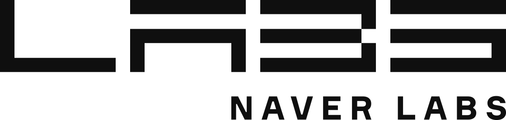

# DTA

<p align="center"> 

</p>

Official implementation of [Drop to Adapt: Learning Discriminative Features for Unsupervised Domain 
Adaptation](https://arxiv.org/abs/1910.05562), to be presented at ICCV 2019.

## Setup

#### Environment
Create a new python virtual environment, and install the packages specified in ```requirements.txt```:

```
pip install -r requirements.txt
```

The code has been tested on Python 3.6.8 with CUDA 9.0 on 4 Titan Xp GPUs.

#### Download Data
Download the [VisDA-2017 Classification](https://github.com/VisionLearningGroup/taskcv-2017-public/tree/master/classification)
data into ```./data```:

```
cd ./data
wget http://csr.bu.edu/ftp/visda17/clf/train.tar
tar xvf train.tar

wget http://csr.bu.edu/ftp/visda17/clf/validation.tar
tar xvf validation.tar  
```

## Running the code

We provide two basic configurations under ```./configs/```
for ResNet-101 and ResNet-50 models. 
```
python main.py --config_path ./configs/resnet101_dta_vat.json
python main.py --config_path ./configs/resnet50_dta_vat.json
```

Hyper-parameters can be changed directly from the command line as well. 
For example, to run the ResNet-101 model without VAT:

```
python main.py --config_path ./configs/resnet101_dta_vat.json --use_vat False
```

Tensorboard logs are saved under the path specified in ```./args.experiment_dir/args.experiment_description```.

## Copyright

All codes on this page are copyrighted by Naver Labs 
and published under the [Creative Commons Attribution-NonCommercial-ShareAlike 4.0 License](https://creativecommons.org/licenses/by-nc-sa/4.0/). 
You must attribute the work in the manner specified by the author. 
You may not use the work for commercial purposes, and you may only distribute the resulting work 
under the same license if you alter, transform, or create the work.

## Acknowledgement  
<div>
This work was done as part of an internship program at <a href='https://www.naverlabs.com/en/'>Naver Labs</a>, Autonomous Driving Group.<br><br>
<br><br>
</div>


## Citation
```
@InProceedings{Lee_2019_ICCV,
    author = {Lee, Seungmin and Kim, Dongwan and Kim, Namil and Jeong, Seong-Gyun},
    title = {Drop to Adapt: Learning Discriminative Features for Unsupervised Domain Adaptation},
    booktitle = {The IEEE International Conference on Computer Vision (ICCV)},
    month = {October},
    year = {2019}
}
```

